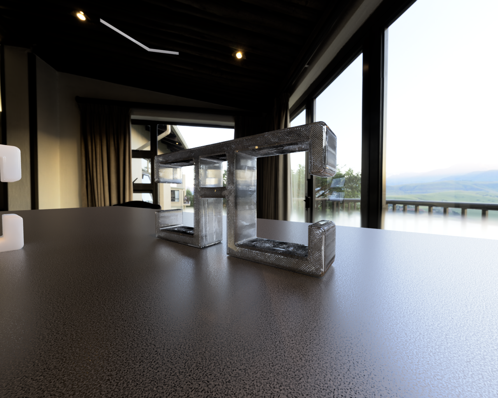
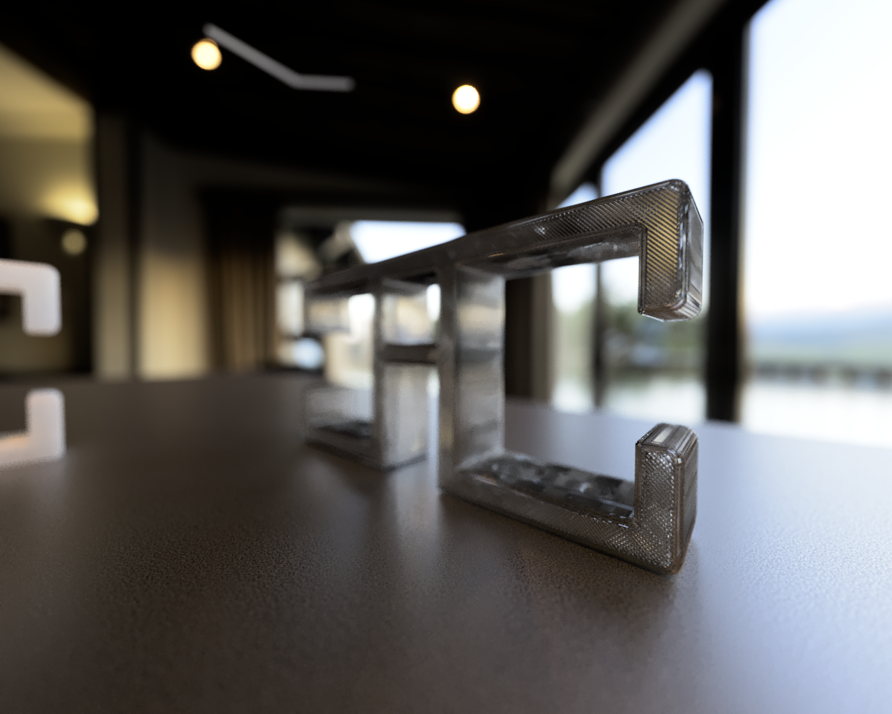

# Cable Organizer: Order and Efficiency

This utilitarian piece is an embodiment of Manuel Levi's affinity for functionality, simplicity and beauty.

The design is deceptively simple yet ingeniously practical. Its robust construction is made to withstood the test of time while minimizing the use of materials, contributing to sustainability. 

## Single Unit

A single unit features a square hole in the
center, providing multiple applications, from cable routing to securing with zip ties or Velcro strips.

## Two Units (X)

When two units are brought together, they seamlessly interlock, forming a cross or "plus sign" pattern. This arrangement is both visually striking and functional, offering a convenient solution for cable organization beneath tables while avoiding breakage and tangling.

When two units converge, a striking visual harmony emerges, forming a cross.

## Made to Last

This cable organizer is meticulously crafted to endure the test of time. Its strength lies not just in function but in the art of durability.

Each curve and angle serve a purpose.

## 3D Print

This piece was designed so it could be easily 3D printed and even laser cut. 

Made to be printed on it's side, if printed with transparent plastic like PETG, you'll be able to see the infill lines of the part.
